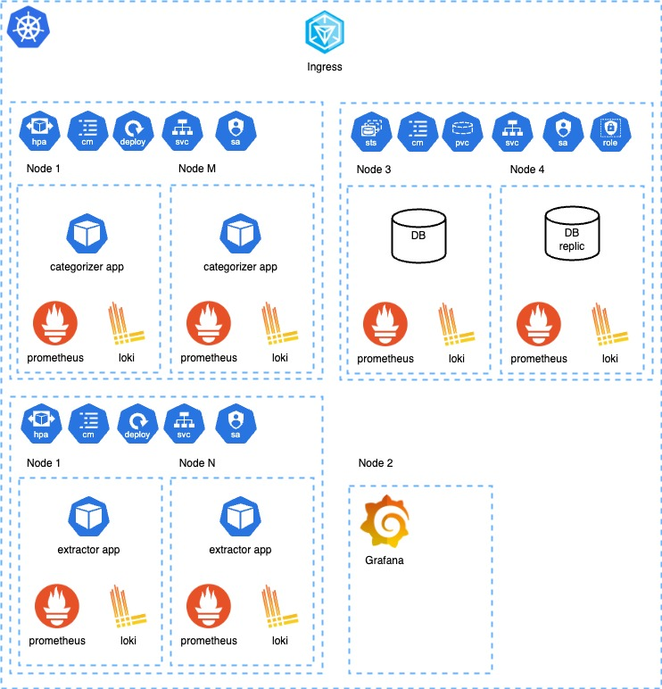

# Categorizer Project 

## Overview
This project is a Spring Boot application that system that categorizes web pages based on a keyword category
and extracts text from URLs.
Project now working as monolithic application. In the future, it will be divided into microservices, for that reason, the project is divided into logical modules.

## Technologies Used
- Java
- Spring Boot
- Gradle

## Modules
### Categorizer
Part of the project that categorizes web pages based on a keyword category.

### Extractor
Part of the project that extracts text from given Web Pages.

##  Complexity Analysis
For each webpage, the complexity is:

N = text length
M = number of categories
J = number of keywords
K = max keyword length
Time Complexity: O(N * K + M * J * K)
O(N * K) - build indexes
O(K * M * J) - search in indexes
Cons:
- huge memory usage

Possible alternatives:
Going through the text and checking if it contains any of the keywords.

## How to Build
To build the project, run the following command:
```
./gradlew build
```
## How to Run
To run the project, use the following command:
```
./gradlew bootRun
```
## Testing
To run the tests, use the following command:
```
./gradlew test
```
## Contact
For any questions or issues, please contact the project maintainers.

## k8s Diagram
Diagram of the Kubernetes architecture for the project.
It's a simple architecture with a single pod for each module with based k8s components and not covered all details.



Solution includes:
- Scalability
- Availability
- Monitoring (Metrics, Logging, Visualization)
- Deployment
- Persistence

Solution doesn't include:
- Durability
- Reliability